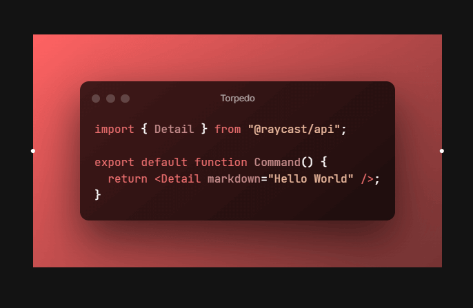

# Ray.so API / Library 🎉✨

[](https://npmjs.com/package/rayso.js)

This is an unofficial Node API for [ray.so](https://ray.so) that turns your code into beautiful images. Get all the features you need from ray.so without actually going there.

## Documentation

You can find the Documentation with examples here: [rayso.js](https://raysojs.vercel.app)

## Navigation

- [Installing](#installing)
- [Usage](#usage)
- [Parameters](#parameters)
- [Examples](#examples)
  - [Default](#default-output)
  - [Custom](#custom-parameters)
  - [No Background](#output-without-background)
- [Themes](#themes)
  - [Candy](#candy)
  - [Crimson](#crimson)
  - [Falcon](#falcon)
  - [Meadow](#meadow)
  - [Midnight](#midnight)
  - [Raindrop](#raindrop)
  - [Sunset](#sunset)
- [Credits](#credits)

## Installing

```bash
$ npm i rayso.js
```

## Usage

```javascript
const RaySo = require('rayso.js');
const raySo = new RaySo({
	// parameters, if you want to customize the output
	// you'll find detailed info about parameters below
});

raySo
	.create(`console.log('Hello, World!');`)
	.then((response) => {
		// response is image buffer
	})
	.catch((err) => {
		console.error(err);
	});
```

👮‍♂️ **Attention!** The API will not work if you don't have any kind of Chrome browser (Chromium). So if your chrome browser is installed in a different directory, make sure to set your full local path to `chrome.exe` in `broswerPath` parameter (or any other execution file of the browser based on Chromium).

```javascript
const RaySo = require('rayso.js');
const raySo = new RaySo({
	// The default path in the API is C:\Program Files\Google\Chrome\Application\chrome.exe
	// If your browser located somewhere else, specify it in browserPath parameter.
	// If it's the same as default one, just don't pass this parameter.
	browserPath: '...your path',
});
```

## Parameters

| Parameter      | Default value                                               | Type             | Description                                                                                                                                    |
| -------------- | ----------------------------------------------------------- | ---------------- | ---------------------------------------------------------------------------------------------------------------------------------------------- |
| `title `       | `"Untitled-1"`                                              | String           | The title that will be displayed on top of the code box.                                                                                       |
| `theme`        | `"breeze"`                                                  | String           | There are several options of how your box will look like. Available themes: breeze, candy, crimson, falcon, meadow, midnight, raindrop, sunset |
| `background`   | `true`                                                      | Boolean          | If disabled, it will create an image of code box only, without background.                                                                     |
| `darkMode`     | `true`                                                      | Boolean          | If disabled, it will change your theme to its light version.                                                                                   |
| `padding`      | `32`                                                        | String or Number | Distance between borders and code box. Available values: 16, 32, 64 and 128.                                                                   |
| `language`     | `"auto"`                                                    | String           | You better leave it auto :/ However, you can try to pass some language name and if it worked, good for you!                                    |
| `localPreview` | `false`                                                     | Boolean          | If enabled, it will create example.png image file of the output in the current directory.                                                      |
| `browserPath`  | `"C:\Program Files\ Google\Chrome\Application \chrome.exe"` | String           | Local path to the browser (Chrome). You can leave it, if it's your home PC and you have Chrome installed.                                      |
| `debug`        | `false `                                                    | Boolean          | If enabled, it will show messages in the console during code execution.                                                                        |

## Useful links

- [Ray.so](https://ray.so)
